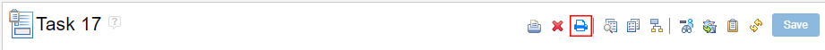
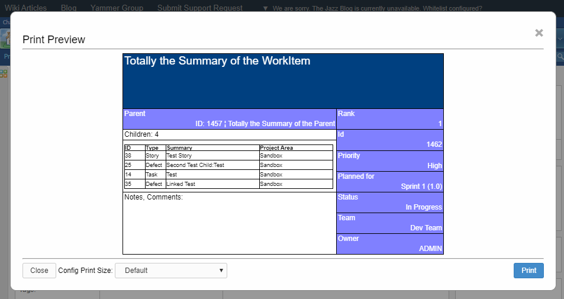

# Printable Workitem Button - How to use

The "Printable Workitem Widget" is a powerful widget which allows you to customize how the Workitem should look when printing it. But because it's a Widget the only possibility to use it inside a Dashboard and in order to change the current displayed Workitem, you need to either create a query, a list or have the permissions to change the settings of the addon. 

By using the "Printable Workitem Button" you can print a workitem and load the right configuration just with one button.

The "Printable Workitem Button" uses the same "Drawing-Engine" as the "Printable Workitem Widget" allowing to use the same configuration files you've already used for the Widget.

All the configurations need to be set as a **"Process Attachment "** in order for the button to find and use them.

## Configuration

You need to create a file called **"printable_wi_print_definition.json"** as a **Process Attachment** in order for the Add-On to be able to load the right configuration.

The file needs to contain a "list" and a "syntax" in order to be valid. See the template below.

    {
	  "list":
	    {
		    "wi-type": "location"
	    },
	  "syntax": "{{type}}.json"
	} 

Based on the configuration the Add-On will generate the **Process Attachment Path** to the **Printable Workitem Configuration**, which then gets applied / printed.

### list
This section of the configuration defines a list, telling which configuration should get loaded based on the type of the current open Work-Item.

The list entry is defined by two values. The first being the Workitem-Type and the second being the configuration which should get loaded. The first value needs to be **unique**.

#### Example

Here you can see what the content of the list could look like.

	{
		"story": "test-story",
		"feature": "test-feature",
		"task": "fallback",
		"defect": "fallback",
	}

### syntax

The syntax defines how the path to the correct configuration will look like.
You have the possibility to use the **"{{type}}"** keyword to replace the Workitem-Type to the translated value, defined in the **list**. The translated value **needs to exist as a Process Attachment** in order to be loaded and applied.

#### Example

	"syntax": "print-wi/config/{{type}}.json"

### Example 
Example of the content of the **"printable_wi_print_definition.json"**

    {
	  "list":
	    {
	      "feature": "feature",		   
	      "story": "story",
		  "task": "default",
		  "defect": "default",
	    },
	  "syntax": "print-wi/printable_wi_{{type}}.json"
	} 

Using the configuration from above we would get the following as a result.

| Workitem-Type | Process Attachment Path |
|--|--|
| feature | print-wi/printable_wi_feature.json |
| story | print-wi/printable_wi_story.json |
| task | print-wi/printable_wi_default.json |
| defect | print-wi/printable_wi_default.json |

### I can't see the button on the Workitem
The button will only appear if the configuration is valid, the Work-Item is defined and the generated Process Attachment Path was found and loaded successfully.

If you don't see the button but you should, you can activate the **"Dev-Mode"** in order to force-load the button and show the error message inside the modal, which will appear, when you click the print button.

## Dev-Mode
In order to enable the **"Dev-Mode"**, you only need to change the current URL. All you need to do is to add **"&dev=true"** to the end of the URL.
| | |
|--|--|
| Default | https://{server-url}/{jazz-base-url}/{jazz-project-area}#action=com.ibm.team.workitem.viewWorkItem&id=123456 |
| Dev-Mode | https://{server-url}/{jazz-base-url}/{jazz-project-area}#action=com.ibm.team.workitem.viewWorkItem&id=123456&dev=true |
| | |

While you're using the Dev-Mode you will get more insight if the anything goes wrong. This can be very useful white setting up everything.

The button will always be loaded and displayed while you're using the **"Dev-Mode"**.

## Setup

### Download

You can find the latest release on the [releases page of this repository](https://github.com/jazz-community/rtc-print-workitem-action/releases).

### Installation

Deploy just like any other update site:

1. Extract the `com.siemens.bt.jazz.workitemeditor.rtcPrintWorkItemAction_updatesite.ini`  **file** from the zip file to the `server/conf/ccm/provision_profiles` directory

2. Extract the `com.siemens.bt.jazz.workitemeditor.rtcPrintWorkItemAction_updatesite`  **folder** to the `server/conf/ccm/sites` directory

3. Restart the server

### Updating an existing installation

1. Request a server reset in **one** of the following ways:

* If the server is currently running, call `https://server-address/ccm/admin/cmd/requestReset`

* Navigate to `https://server-address/ccm/admin?internaltools=true` so you can see the internal tools (on the left in the side-pane). Click on `Server Reset` and press the `Request Server Reset` button

* If your server is down, you can delete the ccm `built-on.txt` file. Liberty packed with 6.0.3 puts this file in a subfolder of `server/liberty/servers/clm/workarea/org.eclipse.osgi/**/ccm`. The easiest way to locate the file is by using your operating system's search capabilities.

2. Delete previously deployed updatesite folder

3. Follow the file extraction steps from the section above

4. Restart the server

## Contributing

Please use the [Issue Tracker](https://github.com/jazz-community/rtc-print-workitem-action/issues) of this repository to report issues or suggest enhancements.

For general contribution guidelines, please refer to [CONTRIBUTING.md](https://github.com/jazz-community/welcome/blob/master/CONTRIBUTING.md).

## Licensing

Copyright (c) Siemens AG. All rights reserved.

Licensed under the [MIT](https://github.com/jazz-community/rtc-print-workitem-action/blob/master/LICENSE) License.

[The print icon](https://github.com/jazz-community/rtc-print-workitem-action/blob/master/resources/images/icons/print-icon.png) by [Font Awesome](https://fontawesome.com/) is used under [CC BY 4.0](https://creativecommons.org/licenses/by/4.0/) / Changed the color to blue
